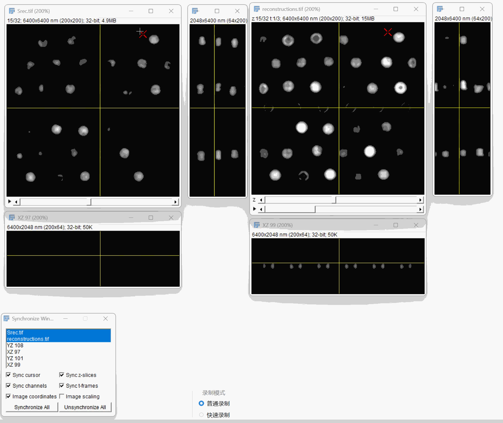

# Fiji 多图 Orthogonal Views

解决 ImageJ/Fiji 的 Orthogonal Views 只能保留一组 XY/XZ/YZ 视图的问题：每个源图像独立保留一组视图。



## 安装

推荐下载 Releases 中的完整 Fiji 压缩包，解压后运行 `Fiji.app/fiji-windows-x64.exe`。

也可以下载补丁包，关闭 Fiji 后运行：

```powershell
python tools/apply_patch.py "D:\\Path\\to\\Fiji.app\\jars\\ij-1.54p.jar"
```

补丁只适用于 README 中列出的基础 JAR 哈希；脚本会先创建 `.original` 备份。

## Git

```bash
git clone https://github.com/gouwenct/fiji-multi-orthogonal-views.git
```

这是非官方 Fiji 修改版。完整 Fiji 的原许可证和第三方声明保留在发行包中。
